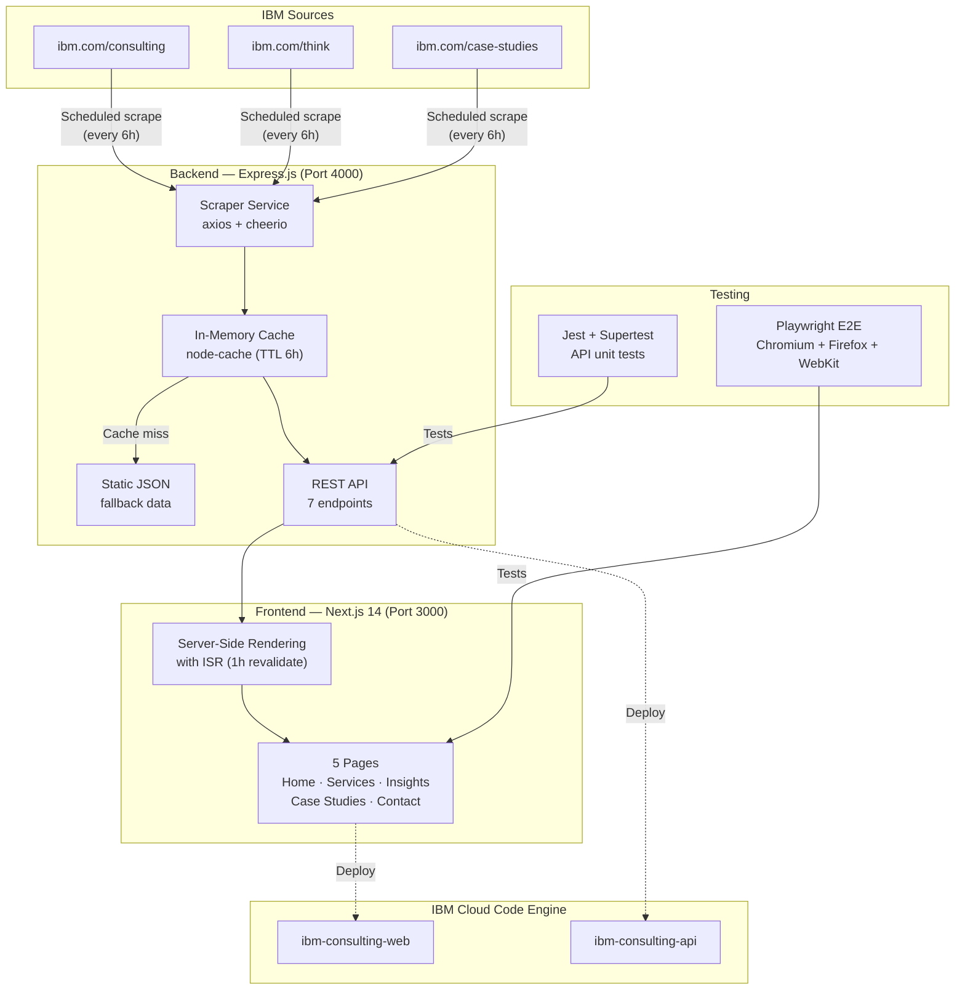
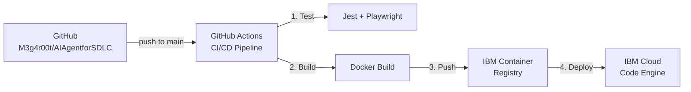

# Architecture — IBM Consulting Showcase

## System Overview



---

## Architecture Decision Records

### ADR-001: Content Acquisition Strategy

| | |
|---|---|
| **Status** | Accepted |
| **Date** | 2026-02-14 |
| **Context** | The app needs real content from ibm.com sites. |
| **Decision** | Hybrid: scheduled scraping + in-memory cache + static JSON fallback |
| **Rationale** | Always works (even if IBM site is down), near real-time content (6h TTL), no external database |
| **Alternatives Rejected** | Pre-scraping at build time (stale content), direct proxy (fragile, slow) |

**Data Flow:**
```
Request → Cache Hit? → Yes → Return (< 2ms)
                    → No  → Scraper → ibm.com → Parse → Cache → Return
                               ↓ (fail)
                         Static JSON fallback
```

---

### ADR-002: Testing Strategy

| | |
|---|---|
| **Status** | Accepted |
| **Date** | 2026-02-14 |
| **Context** | Need automated testing for API and browser UI across browsers |
| **Decision** | Playwright (E2E multi-browser) + Jest/Supertest (API unit tests) |
| **Rationale** | Playwright covers Chromium, Firefox, WebKit in one tool; Supertest is fast for API testing |
| **Alternatives Rejected** | Cypress (Chrome-only focus), Puppeteer (manual setup) |

**Test Suite:**

| Layer | Framework | Files | Coverage |
|-------|-----------|-------|----------|
| API | Jest + Supertest | 2 | Health, CRUD, scraper |
| E2E | Playwright | 6 | All pages + nav |
| Browsers | Playwright | 4 | Chrome, Firefox, Safari, Mobile |

---

### ADR-003: Caching Architecture

| | |
|---|---|
| **Status** | Accepted |
| **Date** | 2026-02-14 |
| **Context** | Scraped content must be cached to avoid excessive requests to IBM |
| **Decision** | In-memory cache using `node-cache` with TTL |
| **Rationale** | Zero dependencies, fast (< 2ms), works in single-instance Code Engine |
| **Upgrade Path** | Swap to Redis for multi-instance deployments |

**TTL Policy:**

| Content | TTL | Rationale |
|---------|-----|-----------|
| Articles | 6 hours | Moderate change frequency |
| Case Studies | 6 hours | Moderate change frequency |
| Services | 24 hours | Rarely changes |

---

## API Reference

| Method | Endpoint | Description | Source |
|--------|----------|-------------|--------|
| `GET` | `/` | Health check | Static |
| `GET` | `/api/health` | Health + cache status | Static |
| `GET` | `/api/insights` | List insights | Cache / Fallback |
| `GET` | `/api/insights/:slug` | Single insight | Cache / Fallback |
| `GET` | `/api/case-studies` | List case studies | Cache / Fallback |
| `GET` | `/api/case-studies/:slug` | Single case study | Cache / Fallback |
| `GET` | `/api/services` | List services | Cache / Fallback |
| `POST` | `/api/contact` | Submit form | Mock |

---

## Deployment Topology



## Tech Stack

| Layer | Technology | Version |
|-------|-----------|---------|
| Frontend | Next.js + React | 14 / 18 |
| Styling | Tailwind CSS | 3.x |
| Backend | Express.js | 4.x |
| Scraping | Axios + Cheerio | Latest |
| Caching | node-cache | 5.x |
| E2E Testing | Playwright | Latest |
| API Testing | Jest + Supertest | 29.x / 6.x |
| Containers | Docker | Multi-stage |
| IaC | Terraform | 1.14 |
| Cloud | IBM Cloud Code Engine | — |
| CI/CD | GitHub Actions | — |
