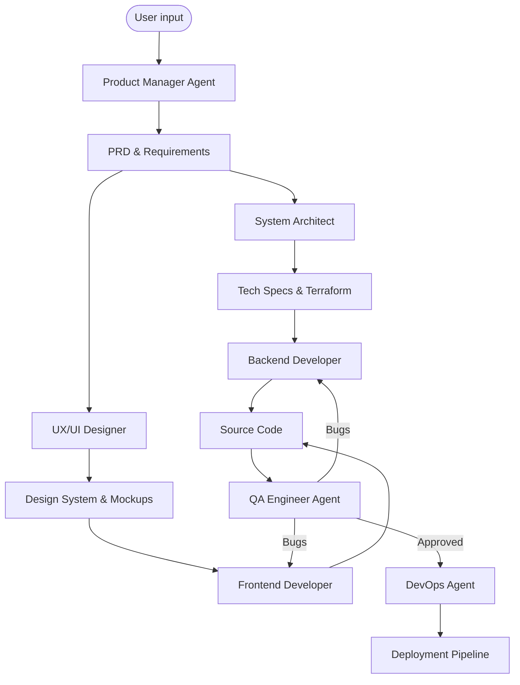

# SDLC Automation Framework Architecture

This document describes the design and operation of the automated Software Development Life Cycle (SDLC) framework within Google Antigravity. The system utilizes a "Single-Agent Core, Simulated Distributed Roles" architecture.

## 1. System Overview

The framework operates as a **Stateful Automation Loop**. It moves through defined states (Ideation -> Requirements -> Design -> Implementation -> Test -> Deploy), utilizing the Agent's ability to switch contexts ("Personas") seamlessly.

## 2. Component Breakdown

### 2.1 The Orchestrator (Antigravity Core)
- **Role**: Maintains the "State" of the project.
- **Mechanism**: References `impl_plan.md` and `task.md` to know which phase is active.
- **Tools**: Utilizes `task_boundary` to visually signal state changes to the user.

### 2.2 The "Virtual Roles"
These are specialized modes of operation triggered by the Orchestrator.

#### **Product Manager (PM)**
- **Input**: User's vague idea.
- **Output**: `PRD.md` (Product Requirements Document).
- **Behavior**: Asks clarifying questions, prioritizes features.

#### **Technical Architect**
- **Input**: `PRD.md`.
- **Output**: `ARCHITECTURE.md`, choices on Tech Stack (e.g., Next.js + Python + Postgres).
- **Behavior**: Selects cloud-native patterns (Containers, Serverless).

#### **UX/UI Interface**
- **Input**: `PRD.md` + Architect's choices.
- **Output**: `design_system.css`/`tailwind.config.js`, wireframe descriptions.
- **Behavior**: Enforces premium, modern aesthetics.

#### **Developer Agents (FE/BE)**
- **Input**: Specs and Designs.
- **Output**: Functional Code.
- **Behavior**: Implements logic, writes tests, adheres to 12-factor apps.

#### **QA/Security**
- **Input**: Source Code.
- **Output**: Test Reports, Security Audits.
- **Behavior**: Runs linters, static analysis, unit tests.

#### **DevOps**
- **Input**: Tested Code.
- **Output**: Dockerfiles, K8s manifests, CI/CD pipelines.
- **Behavior**: Manages the 3-tier pipeline (PR Validation -> QA -> Prod).

## 3. Data Flow & Communication

1.  **Context Sharing**: All agents share the same project workspace (`/home/user/project`).
2.  **Artifact Hand-off**:
    - PM writes to `requirements/`.
    - Architects read `requirements/` and write to `design/`.
    - Devs read `design/` and write to `src/`.
3.  **User Loop**: The user is looped in at critical gates (Requirement Sign-off, Design Review, Final Deployment Approval).

## 4. Implementation Details

- **Language Support**: Polyglot (Python, TypeScript, Go, Rust, Java).
- **Infrastructure**: Terraform or Pulumi for IaC.
- **Containerization**: Docker as the standard unit of delivery.
- **Orchestration**: Kubernetes (simulated for local dev via Minikube/Kind, or cloud GKE/EKS).

## 5. Usage

To activate this framework, use the prompt defined in `sdlc_automation_prompt.md`.
